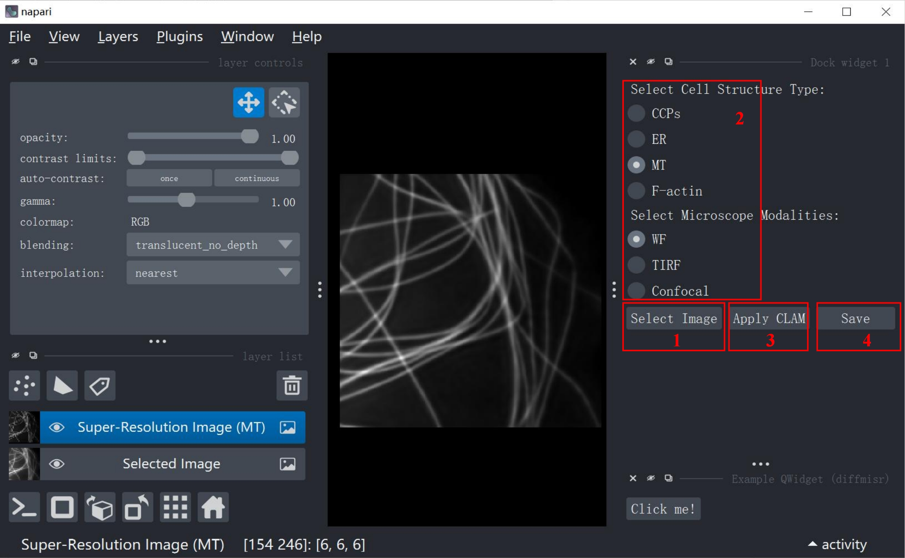
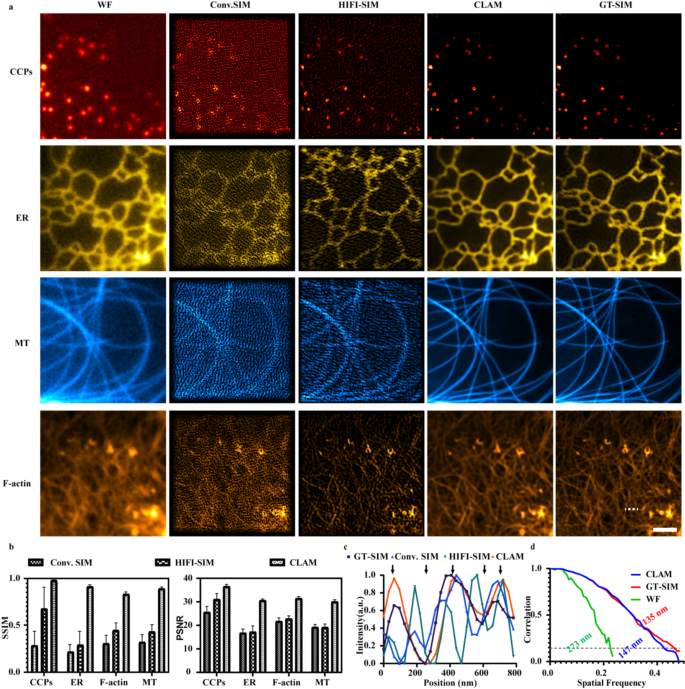
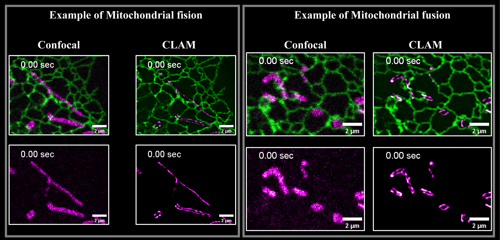
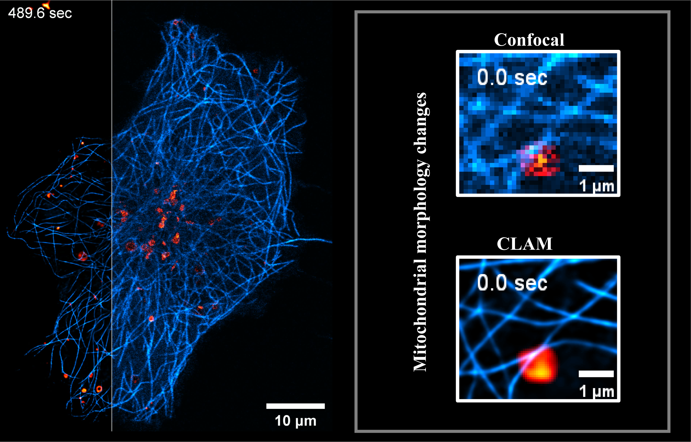

# CLASI: Combined Learning for Augmented Super-Resolution Imaging

CLASI is a two-stage deep learning framework designed to reconstruct high-resolution super-resolution (SR) images from low signal-to-noise ratio (SNR), diffraction-limited wide-field (WF) microscopy images. CLASI integrates the high-fidelity restoration capabilities of supervised deep learning (SDL) models with the ultra-fine structure generation strengths of generative deep learning (GDL) models, which provides robust and high-fidelity SR reconstructions, enabling researchers to visualize intricate subcellular structures and dynamic interactions.


## Installation

### Prerequisites

- Python ==3.10.13
- torch==1.13.1+cu116

### Installation Steps

1. Clone the CLASI repository from GitHub.
    
    ```bash
    git clone <https://github.com/your-repo/CLASI.git>
    cd CLASI
    ```
    
2. Create a virtual environment and install PyTorch and other dependencies.
    
    ```bash
    conda create -n CLASI python=3.10.13
    conda activate CLASI
    ```
    
3. Install the required dependencies.
    
    ```bash
    pip install -r requirements.txt
    ```
    
4. <a href="https://zenodo.org/records/14550936" target="_blank">Download</a> and install the CLASI napari plugin.
    
    ```bash
    pip install CLASI.whl
    ```
    

## Usage

### Launching the Plugin

1. Open napari:
    
    ```bash
    napari
    ```
    
2. Load the CLASI plugin by navigating to the `Plugins` menu and selecting `CLASI`.

### Step-by-Step Guide


### Step 1: Load an Image

- Click the **"Select Image"** button to choose a WF microscopy image for processing.

### Step 2: Select Parameters

- Choose the subcellular structure type from the dropdown menu (e.g., CCPs, ER, MTs, or F-actin).
- Select the microscopy modality (WF, TIRF, or Confocal).

### Step 3: Apply Super-Resolution

- Click the **"Apply Super-Resolution"** button to start the reconstruction process.
- Once completed, the processed SR image will be displayed in napari.

### Step 4: Save the Results

- Click the **"Save Image"** button to export the SR image to your desired directory.

## Example Data

To test the functionality of CLASI, example datasets are available in the `example_data/` directory of the GitHub repository.

## **Characrization of CLASI**

- High-fidelity SR reconstruction under low SNR conditions.



- Supports various microscopy modalities and subcellular structures.


- CLASI enables researchers to observe interactions between organelles with high resolution and high signal-to-noise ratio.





